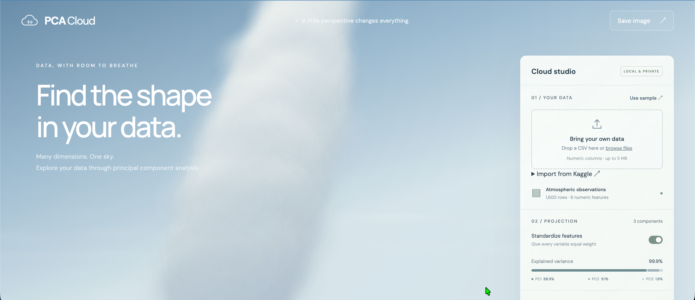

<div align="center">

# PCA Cloud ☁️

### Turn your data into a cloud you can explore.

Discover patterns across your numeric features with interactive 3D clouds, PCA, and t-SNE.

**[Open PCA Cloud →](https://archipelagoing.github.io/PCACloud/)**

No sign-up · No installation · Your data stays in your browser

[](https://archipelagoing.github.io/PCACloud/)

*if you look up at the sky, i wonder, can you find your data there?*

</div>

## Your spreadsheet, with its head in the clouds.⋆｡˚ ☁︎ ˚｡⋆

A table gives you the numbers. PCA Cloud helps you explore how they fit together. Bring measurements from an experiment, a public dataset, or a CSV you've been curious about, and see their projected shape in three dimensions.

- **Look for patterns worth investigating!** Explore groups, spread, and unusual points from different angles.
- **Build intuition as you go...** Switch between PCA and t-SNE to see how different ways of simplifying the same data change the picture.
- **Make the view your own** Choose soft cloud particles or individual data points, adjust the atmosphere, and save an image for a slide, notebook, or conversation.
- **Keep your data on your device.** Uploaded CSVs are processed locally in your browser. No account or API key is needed.

## Try it today with a ready-made cloud! ⋆｡˚ ☁︎ ˚｡⋆

**[Open the app](https://archipelagoing.github.io/PCACloud/)** and the built-in atmospheric sample is ready to explore. You don't need a dataset to get started.

1. **Drag to orbit.** See the cloud from another angle. Scroll or use **+/−** to zoom.
2. **Choose Data points.** See the individual projected rows behind the cloud.
3. **Switch to t-SNE.** Explore local similarities, then switch back to PCA to compare the views.
4. **Save your favorite view.** Select **Save image** to download a PNG.

Use **Reset view** whenever you want to return to the starting camera position.

## Bring your own data  ⋆｡˚ ☁︎ ˚｡⋆

### Drop in a CSV

Drop a file onto **Bring your own data**, or click to browse. Include a header row and at least two numeric columns with two complete data rows.

You can explore files up to **5 MB** and **100 columns**. Text columns are excluded, and incomplete or malformed rows are skipped. Remove numeric IDs or other columns you don't want included before uploading.

### Explore a public Kaggle dataset

Open **Import from Kaggle** and select **Try Iris dataset**, or paste a public dataset link, choose **Find CSVs**, and select **Visualize dataset** for your chosen file.

If Kaggle can't serve the file directly to your browser, download the CSV yourself and drop it into the app. Private datasets, competition authentication, and ZIP extraction aren't supported.

## Two ways to see the same data ⋆｡˚ ☁︎ ˚｡⋆

| Choose | When you want to… | What to look at |
| --- | --- | --- |
| **PCA** | Explore the main directions of variation across your features | Explained variance shows how much variation the first three components retain |
| **t-SNE** | Explore which rows have similar feature values locally | Nearby points can suggest neighborhoods to investigate; global distances and cluster sizes need care |

**Try toggling Standardize features**, especially when your columns use different units. It scales features to equal sample variance so their original measurement scales don't dominate the analysis.

PCA's two objective options produce the same point positions; they let you emphasize explained variance or reconstruction error. For t-SNE, changing perplexity lets you explore different neighborhood scales.

These views help you ask questions about your data. A visible group alone doesn't establish a meaningful category, and a 3D projection can leave information out. Cloud density and particle size change the appearance, not the analysis.

<details>
<summary><strong>More about sampling and projection metrics</strong></summary>

- CSVs with more than 2,500 valid rows are evenly sampled before analysis.
- t-SNE uses at most 500 rows, runs for 500 iterations, and uses a fixed seed. Identical inputs and settings give reproducible results; a fixed iteration count does not guarantee convergence.
- t-SNE's KL divergence is not comparable to PCA's explained variance or reconstruction error, and should not be compared directly across different datasets or perplexities.
- With two numeric features, PCA produces a flat projection. Constant data produces a validation message.
- The sample is synthetic atmospheric data. The cloud is an artistic rendering, not a weather simulation.

See [Projection methods](docs/PROJECTIONS.md) for the mathematics, implementation details, and interpretation limits.

</details>

## Your data stays with you ⋆｡˚ ☁︎ ˚｡⋆

CSV parsing and projection calculations happen on your device. The app does not upload your dataset.

The page loads fonts from Google Fonts, with system-font fallbacks. If you use the Kaggle importer, your browser also contacts Kaggle and its download host. Each import requests the current file; datasets aren't refreshed in the background.

**[Find the shape in your data →](https://archipelagoing.github.io/PCACloud/)** ⋆｡˚ ☁︎ ˚｡⋆

---

## For contributors ⋆｡˚ ☁︎ ˚｡⋆

Built with vanilla JavaScript and Canvas 2D, with no build step or runtime package dependencies. See the [roadmap](docs/todo.md) for fixes, release checks, and ideas for future features.

<details>
<summary><strong>Project structure</strong></summary>

```text
PCACloud/
├── index.html       # Site entry point
├── src/             # App, projections, Kaggle import, and worker
├── styles/          # Site stylesheet
├── assets/          # Site images and favicon
├── tests/           # Automated tests
├── docs/            # Projection guide, roadmap, and screenshot
├── .github/         # GitHub Pages deployment workflow
├── package.json     # Local server and test commands
├── README.md
└── LICENSE
```

</details>

<details>
<summary><strong>Run locally, test, and deploy</strong></summary>

### Run locally

With Node.js/npm and Python 3 installed:

```sh
npm start
```

Open [localhost:5173](http://localhost:5173). No dependency installation is needed. Any static web server can also serve the directory.

### Run tests

```sh
npm test
```

Tests use Node's built-in test runner and cover PCA variance, component orthogonality, scale invariance, reconstruction error, CSV parsing and validation, mocked Kaggle responses, and t-SNE affinities, gradients, and reproducibility.

### Deploy to GitHub Pages

In [repository Settings → Pages](https://github.com/archipelagoing/PCACloud/settings/pages), select **GitHub Actions** as the deployment source.

The included [workflow](.github/workflows/pages.yml) runs tests and publishes the static site on every push to `main`. You can also start it manually from the repository's **Actions** tab. Relative asset paths support the `/PCACloud/` project path.

</details>

Licensed under [Apache License 2.0](LICENSE).

For Tyler.
